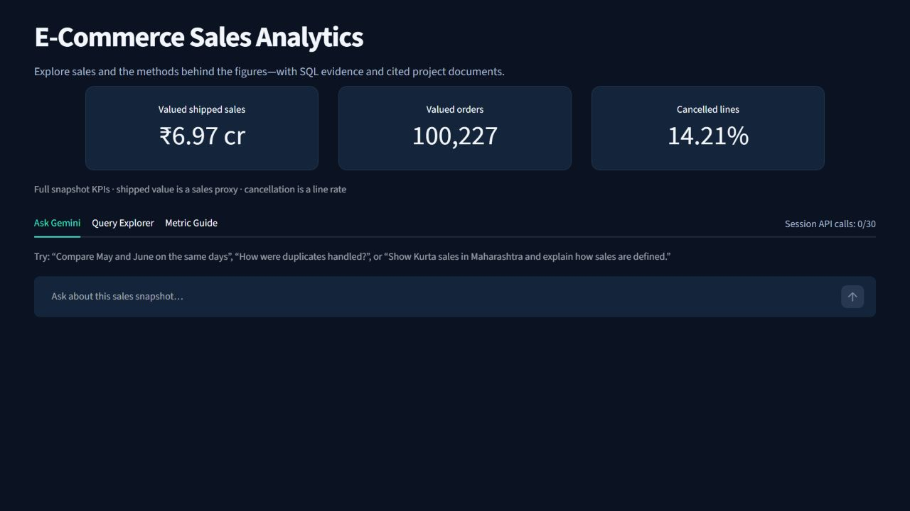
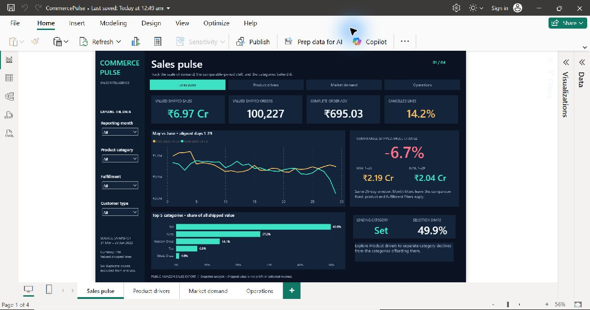

# E-Commerce Sales Analytics

A resume project combining Python data cleaning, a MySQL star schema, Power BI
reports, and a Streamlit assistant with Gemini function calling and document RAG.

**[Open the live demo](https://ecommerce-sales-analytics-daks5.streamlit.app/)**
— Query Explorer is public; ask the project author for the Gemini demo code.

The source is the public [Kaggle e-commerce sales dataset](https://www.kaggle.com/datasets/thedevastator/unlock-profits-with-e-commerce-sales-data).
The Amazon snapshot covers 31 March–29 June 2022. Six exact duplicate copies
are excluded, leaving 128,969 analytical order lines. Shipped value is a sales
proxy; the dataset cannot establish profit, cancellation reasons or official
Amazon policies.

## Application

- Ask questions about sales and project methods. MySQL calculates the figures;
  Gemini chooses among 14 reviewed analyses and explains the evidence.
- Inspect SQL, bound filters, tables and downloadable aggregate CSV results.
- Retrieve definitions and cleaning decisions from four project documents,
  with inspectable citations. The checked-in index contains 17 passages.
- Explore the same SQL analyses without using Gemini in Query Explorer.



## Architecture

```text
Kaggle CSV → Python cleaning → MySQL star schema → Power BI
                                  ↓
Streamlit question → Gemini tools → reviewed SELECT queries
                           ↓
                 document retrieval → cited explanation
```

`assistant/` is the online runtime. `src/` contains the original analysis
pipeline as portfolio evidence; it is not the cloud database migration tool.
`sql/` contains the schema, views and analysis queries. `powerbi/` contains the
report definitions and measures; publishing Streamlit does not host Power BI.
Raw data, credentials and database dumps are excluded from this repository.

## Deploy and run

Follow [the cloud deployment guide](docs/cloud_deployment.md). The hosting
target is Streamlit Community Cloud with a separate Aiven MySQL service.

```sh
python -m pip install -r requirements.txt
streamlit run assistant/app.py
```

Select Python 3.13 in Streamlit's advanced deployment settings and supply the
completed `.streamlit/secrets.example.toml` through its secrets manager.
The remote database must use the provider's CA certificate and a SELECT-only
reader. TLS issuer and hostname verification are required in cloud mode.

Query Explorer is public. Gemini needs a random demo access code of at least
12 characters, plus a configured API key. There are browser-session and shared
process hourly allowances; the latter resets when the application restarts.
These are demo usage controls, not provider billing limits. Configure provider
quotas separately and share the access code only with intended reviewers.

## Validation and delivery status

The finished local project passed 103 automated tests and live SQL/RAG checks.
That report is in `reports/final_project_audit.json` and describes the local
project. Deployment-specific preflight results are saved separately in
`reports/cloud_preflight_tests.xml`. A public URL is only considered complete
after cloud database import, secret setup and online verification.


