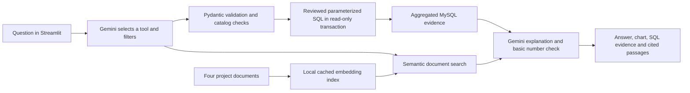

# Commerce Pulse AI — Version 2

A separate local Streamlit analyst using Gemini function calling, document RAG and the existing MySQL project. Power BI remains the presentation dashboard. No new data download or database reload is needed on this computer. See [RAG setup and sources](rag_guide.md).

## Open the app

Double-click `Start AI Analyst.cmd` in the project folder, or run:

```powershell
.\.venv-assistant\Scripts\python.exe -m streamlit run assistant\app.py
```

Open http://127.0.0.1:8501. Keep the launcher running while using the app. Close its console or press Ctrl+C to stop it. If this port is already in use, stop your previous assistant instance or pass `--server.port 8502` and use that address.

The isolated `.venv-assistant` environment keeps the original pipeline environment separate. To recreate it:

```powershell
python -m venv .venv-assistant
.\.venv-assistant\Scripts\python.exe -m pip install -r requirements-assistant.txt
```

## Gemini configuration

Add these settings to the existing local `.env` file; preserve its MySQL credentials:

```dotenv
GEMINI_API_KEY=your_private_key
GEMINI_MODEL=gemini-3.5-flash-lite
ASSISTANT_MAX_REQUESTS=30
```

Create a key in [Google AI Studio](https://aistudio.google.com/apikey). Never paste it into chat, screenshots or a repository. Reload the app after editing `.env`. A configured key does not prove that its project has model access or quota. The model is configurable because availability and account limits differ.

The SDK uses Google's [Interactions API](https://ai.google.dev/gemini-api/docs/interactions-overview) with `store=False` and [function calling](https://ai.google.dev/gemini-api/docs/function-calling). Your question, recent conversation context, metric definitions, filter catalogs and aggregated SQL results are sent to Gemini. Raw order records and MySQL credentials are not included. `store=False` disables conversation storage for this API feature; Google's account and data-use terms still apply.

Each question allows up to three generation requests, one document-search embedding request and four SQL analyses. A session has a configurable request allowance, including failed attempts and embedding searches; a new browser session can reset it. One-time index builds run separately. This is a local usage guard, not an account-wide budget cap. There are no automatic application retries; provider rate limits and billing apply independently.

## Workflow



Gemini chooses among the project's 14 SQL analyses. It does not generate executable SQL. Bound parameters apply category, shipping state, fulfillment, customer type and date filters. Result rows are capped at 200, with a 15-second MySQL SELECT limit. The original views exclude the six duplicate copies and preserve missing amounts.

“May vs June” uses days 1–29 of both months. Its two comparison tools ignore date filters and display that behavior explicitly. Order-level calculations derive the selected set of orders from filtered lines, while retaining the original full-order valuation-completeness flag. When filtering to a category, value reflects selected lines rather than all categories within those orders. Top-SKU analysis retains the original ≥30-line threshold and category rank ≤5 rule; it is not an arbitrary top-N SKU selector.

SQL evidence is authoritative. The numeric check checks digit values against results and supported display conversions. It cannot establish semantic correctness, detect every misleading claim or replace review. Unsupported digits trigger a deterministic summary with the SQL table. Profit, retention, causal uplift and reliable forecasts need additional data or models and have explicit limitation tools.

## What to try

- Give me the full snapshot sales overview.
- Compare May and June using the same days.
- Which categories contribute to the May–June decline?
- Show the top 5 shipping states for Set.
- Follow up: Only Merchant fulfillment.
- Compare cancellation line rates by fulfillment.
- What is the complete-order average order value?
- How much data has missing amounts?
- What is our profit? (The answer should explain the missing cost data.)

The **Query Explorer** runs these SQL analyses without any Gemini call. Choose filters, inspect charts and tables, expand SQL evidence, and download aggregate CSV results. The **Metric Guide** displays definitions and knowledge-base status. Chat can also explain methods with citations to retrieved project documents.

## Database protection

Every assistant connection sets `SET SESSION TRANSACTION READ ONLY`; initialization verifies it. Only fixed SELECT/CTE templates are exposed. The existing project loader connection is used if no assistant account is configured. That account still has broader database privileges outside this application. Runtime read-only transactions are not equivalent to a least-privilege database account.

For stronger deployment isolation, a MySQL administrator can create a separate account with SELECT on `ecommerce_db.v_order_lines` (and optionally `v_order_summary`) and configure:

```dotenv
MYSQL_ASSISTANT_USER=your_readonly_user
MYSQL_ASSISTANT_PASSWORD=your_private_password
```

The app requires only `v_order_lines`: it derives filtered order summaries itself. This build does not reset the root password, restart MySQL or grant new privileges. It binds to localhost and has no authentication layer; network deployment would require additional work.

## Files and verification

- `assistant/app.py`: Streamlit interface, charts and evidence panels.
- `assistant/gemini.py`: bounded tool loop, contextual follow-ups, errors and numeric fallback.
- `assistant/queries.py`: validated schemas, bound filters and read-only SQL execution.
- `assistant/system_prompt.txt`: question routing and metric rules.
- `assistant/config.py`: local configuration, with secrets hidden from object representations.
- `sql/02_business_analysis.sql`: original reviewed analyses reused directly.
- `tests/test_assistant.py`: original-result reconciliation, independent filtered Python checks, validation and mocked Gemini orchestration.
- `assistant/rag.py`: allowlisted document chunking, Gemini embeddings, persistent semantic retrieval and source provenance.
- `tests/test_rag.py`: retrieval, provenance, citation and request-budget checks.
- `tests/test_assistant_ui.py`: rendered explorer, chat evidence, source passages, usage tracking and provider-error checks.
- `reports/assistant_test_results.xml`: local automated-test evidence.

```powershell
.\.venv-assistant\Scripts\python.exe -m assistant
# Optional: one real Gemini request, with redacted diagnostics
.\.venv-assistant\Scripts\python.exe -m assistant --gemini
.\.venv-assistant\Scripts\python.exe -m pytest tests -q
```

Automated SQL and mocked-provider tests do not establish natural-language routing accuracy. Live Gemini evaluation is recorded separately in `reports/assistant_live_evaluation.local.json`. Inspect the completion report for the actual delivery and live-test status.

To repeat the nine curated live cases (up to 30 API requests):

```powershell
.\.venv-assistant\Scripts\python.exe -m assistant.evaluate
```

Service errors stop this evaluation early and are recorded as failures, rather than counted as successful answers. Google returned temporary high-demand errors during the initial build; a key-presence indicator alone does not certify a successful chat response.

On this computer, **Gemini 3.5 Flash Lite passed all nine curated cases using 16 API requests**. Cases cover full-snapshot sales, aligned May/June comparison, category contribution, a top-five-state query, Merchant follow-up filters, AOV, data quality, profit limitations and a database-write request. One comparison answer used the numeric fallback. This validates these examples, not every possible question. The larger 3.8/3.7 Flash models returned high-demand errors, so the tested lightweight model is configured locally.

The original Version 2 combined automated run passed **70 tests**. The assistant was also exercised in the actual local browser: category results and a real Gemini May/June comparison displayed their SQL tables and charts. Dependency checks reported no broken requirements. That completion summary is `reports/assistant_completion.json`. Subsequent RAG regression and live evidence are recorded separately in `reports/rag_test_results.xml` and `reports/rag_live_evaluation.json`.
